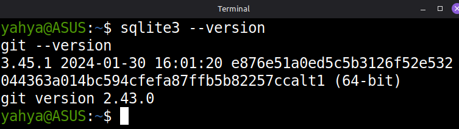
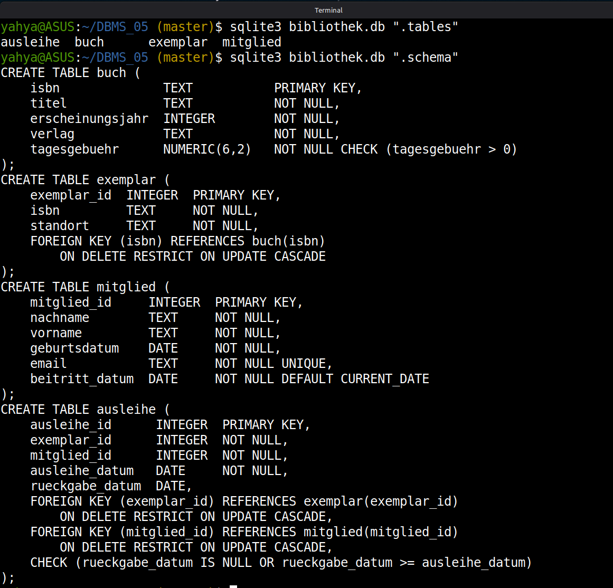
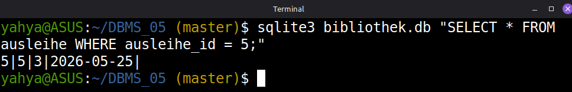
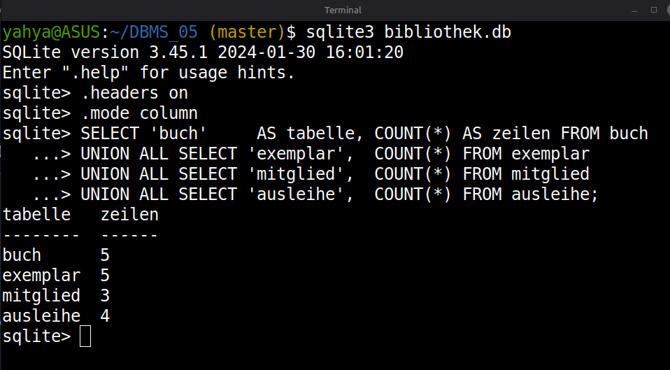

# DBMS_05 – From Schema to Data: DDL and DML in Practice

**Module:** Databases · THGA Bochum  
**Lecturer:** Stephan Bökelmann · <sboekelmann@ep1.rub.de>  
**Repository:** <https://github.com/MaxClerkwell/DBMS_05>  
**Prerequisites:** DBMS_01, DBMS_02, DBMS_03, DBMS_04, Lecture 05 (SQL I – DDL & DML)  
**Duration:** 90 minutes

---

## Learning Objectives

After completing this exercise you will be able to:

- Choose appropriate **SQL data types** for a given domain and justify the choice
- Write **`CREATE TABLE`** statements with column and table constraints
  (`PRIMARY KEY`, `FOREIGN KEY`, `NOT NULL`, `UNIQUE`, `CHECK`, `DEFAULT`)
- Declare **referential actions** (`ON DELETE`, `ON UPDATE`) and argue for the
  correct choice per relationship
- Use **`ALTER TABLE`** to add, drop, and modify columns and constraints
- Write **`INSERT`**, **`UPDATE`**, and **`DELETE`** statements — including
  multi-row inserts and updates with subqueries
- Protect destructive DML with **`BEGIN` / `ROLLBACK` / `COMMIT`** and explain
  why Autocommit is dangerous in practice

**After completing this exercise you should be able to answer the following questions independently:**

- Why is `NUMERIC(p,s)` mandatory for monetary values, while `REAL` is not?
- What is the difference between a column constraint and a table constraint —
  and when must a table constraint be used?
- Why does a `CHECK` constraint never reject a `NULL` value?
- What is the effect of a missing `WHERE` clause in `UPDATE` and `DELETE`?

---

## Check Prerequisites

```bash
sqlite3 --version
git --version
```

> You should see two version strings — SQLite 3.x and Git 2.x.
> If SQLite is missing:
>
> ```bash
> sudo apt-get install -y sqlite3   # Debian / Ubuntu
> brew install sqlite3              # macOS
> ```

> **Screenshot 1:** Take a screenshot of your terminal showing both
> successful version checks and insert it here.
>
> 

---

## 0 – Fork and Clone the Repository

**Step 1 – Fork on GitHub:**  
Navigate to <https://github.com/MaxClerkwell/DBMS_05> and click **Fork**.
Keep the default settings and confirm.

**Step 2 – Clone your fork:**

```bash
git clone git@github.com:<your-username>/DBMS_05.git
cd DBMS_05
ls
```

> You should see only the `README.md`. You will create all further files
> yourself during this exercise.

---

## 1 – The Domain: A Municipal Library

A small municipal library manages its collection, members, and lending
transactions in a relational database. The library needs to track:

- **Books** — each identified by its ISBN, with a title, publication year,
  publisher, and a recommended lending price per day in euro.
- **Copies** — a book can exist in multiple physical copies, each stored at a
  specific shelf location.
- **Members** — registered with name, date of birth, e-mail address, and the
  date they joined the library.
- **Loans** — a member borrows a specific copy on a given date. The return date
  is recorded when the copy is handed back; until then it remains unknown.

The entity-relationship structure is deliberately given to you so that this
exercise can focus entirely on DDL and DML. Your task is to implement this
schema correctly in SQL.

### The Relations

| Relation    | Attributes (informal)                                                               | Primary Key           |
|-------------|-------------------------------------------------------------------------------------|-----------------------|
| `buch`      | isbn, titel, erscheinungsjahr, verlag, tagesgebuehr (in €)                         | isbn                  |
| `exemplar`  | exemplar_id, isbn (FK), standort                                                    | exemplar_id           |
| `mitglied`  | mitglied_id, nachname, vorname, geburtsdatum, email, beitritt_datum                 | mitglied_id           |
| `ausleihe`  | ausleihe_id, exemplar_id (FK), mitglied_id (FK), ausleihe_datum, rueckgabe_datum   | ausleihe_id           |

### Task 1 – Identify the Correct Data Types

For each attribute in the table above, choose the most appropriate SQL standard
data type and write it into the table below. Justify each choice in one sentence.
Use `NUMERIC(p,s)` for monetary values; choose the most precise date/time type
for each temporal attribute.

| Attribute              | Your Type         | Justification |
|------------------------|-------------------|---------------|
| isbn                   | `TEXT`            | An ISBN contains hyphens and a possible leading zero, so it is an identifier string, not a number to do arithmetic on. |
| titel                  | `TEXT`            | Free-form text. |
| erscheinungsjahr       | `INTEGER`         | A whole calendar year with no fractional part is an integer. |
| verlag                 | `TEXT`            | Free-form text. |
| tagesgebuehr           | `NUMERIC(6,2)`    | Fixed-point decimal avoids floating-point rounding error. |
| exemplar_id            | `INTEGER`         | Surrogate key; in SQLite an `INTEGER PRIMARY KEY` auto-increments and is the most efficient row id. |
| standort               | `TEXT`            | Free-form text. |
| mitglied_id            | `INTEGER`         | Surrogate key, same reasoning as `exemplar_id`. |
| nachname               | `TEXT`            | Free-form name text. |
| vorname                | `TEXT`            | Free-form name text. |
| geburtsdatum           | `DATE`            | A calendar date; the `DATE` affinity lets us use `julianday()` and date comparisons. |
| email                  | `TEXT`            | Free-form text. |
| beitritt_datum         | `DATE`            | A calendar date, defaulted to `CURRENT_DATE`. |
| ausleihe_id            | `INTEGER`         | Surrogate key. |
| ausleihe_datum         | `DATE`            | The date a copy was borrowed. |
| rueckgabe_datum        | `DATE` (nullable) | The return date allowed to be `NULL` while the copy is still out. |

### Questions for Task 1

**Question 1.1:** `tagesgebuehr` could be stored as `REAL`. Give a concrete
example — using arithmetic — of why `REAL` would produce an incorrect result
for a lending fee calculation. Which type must be used instead?

> *Your answer:* REAL is binary floating point. Most short decimals have no exact binary representation, which means 0.1 + 0.1 + 0.1 gives 0.30000000000000004, not  0.3. For a daily fee of 0.10 €, a 7-day loan should total 0.70 €. In REAL it
won't. That error is tiny once; across thousands of invoices it becomes a  
reconciliation problem. NUMERIC(6,2) stores values as exact fixed-point decimals. 0.10 + 0.10 + 0.10
is 0.30. Use it for money, not REAL.

**Question 1.2:** `rueckgabe_datum` must be nullable. Explain what `NULL` means
in this specific context. Is `NULL` the same as "zero days"? Justify with
reference to the three-valued logic of SQL.

> *Your answer:* NULL here means the return date is unknown. The book is still out, with no return date because there's been no return yet. It's not zero and it's not empty; those would be known values. NULL is the absence of any value. That matters because SQL uses three-valued logic: TRUE, FALSE, and UNKNOWN. Any comparison against NULL evaluates to UNKNOWN, not FALSE. rueckgabe_datum = '2026-05-01' won't tell you whether a loan is open; it returns UNKNOWN. IS NULL is the right check. = something isn't.

**Question 1.3:** `beitritt_datum` should default to today's date when no value
is provided. Write the `DEFAULT` expression you would use and explain why this
is preferable to always supplying the date explicitly in the application.

> *Your answer:*  `beitritt_datum DATE NOT NULL DEFAULT CURRENT_DATE` lets the database fill in 
   the join date, so the rule lives in one place. The web app, a maintenance   
   script, a raw `sqlite3` session whatever inserts the row gets the right 
   value without having to think about it. Leave it to callers and you're      
   trusting each one to remember, pass the right date, and agree on what 
   "today" is. That's three ways to get it wrong instead of one.

---

## 2 – DDL: Create the Schema

### Task 2a – Write schema.sql

```bash
vim schema.sql
```

Write `CREATE TABLE` statements for all four relations. Requirements:

- Every column must have an explicit type.
- Apply `NOT NULL` everywhere a value must always be present.
- `email` in `mitglied` must be unique across all members.
- `tagesgebuehr` must be greater than zero.
- `rueckgabe_datum`, if not `NULL`, must be greater than or equal to
  `ausleihe_datum` — express this as a table-level `CHECK` constraint.
- `beitritt_datum` must default to the current date.
- All foreign keys must declare `ON DELETE` and `ON UPDATE` actions:
  - Deleting a `buch` record must be refused as long as copies exist.
  - Deleting an `exemplar` record must be refused as long as active loans exist.
  - Deleting a `mitglied` record must be refused as long as loans exist.
  - Updating a primary key value must cascade to all dependent tables.
- Use SQLite types only (`INTEGER`, `TEXT`, `REAL`, `NUMERIC`, `DATE`).

> **Hint:** In SQLite, foreign key enforcement is off by default.
> Always run `PRAGMA foreign_keys = ON;` before your DDL and DML statements
> within the same session.

<details>
<summary>Solution skeleton — try it yourself first</summary>

```sql
PRAGMA foreign_keys = ON;

CREATE TABLE buch (
    isbn              TEXT           PRIMARY KEY,
    titel             TEXT           NOT NULL,
    erscheinungsjahr  INTEGER        NOT NULL,
    verlag            TEXT           NOT NULL,
    tagesgebuehr      NUMERIC(6,2)   NOT NULL CHECK (tagesgebuehr > 0)
);

CREATE TABLE exemplar (
    exemplar_id  INTEGER  PRIMARY KEY,
    isbn         TEXT     NOT NULL,
    standort     TEXT     NOT NULL,
    FOREIGN KEY (isbn) REFERENCES buch(isbn)
        ON DELETE RESTRICT ON UPDATE CASCADE
);

CREATE TABLE mitglied (
    mitglied_id     INTEGER  GENERATED ALWAYS AS IDENTITY PRIMARY KEY,
    nachname        TEXT     NOT NULL,
    vorname         TEXT     NOT NULL,
    geburtsdatum    DATE     NOT NULL,
    email           TEXT     NOT NULL UNIQUE,
    beitritt_datum  DATE     NOT NULL DEFAULT CURRENT_DATE
);

CREATE TABLE ausleihe (
    ausleihe_id      INTEGER  PRIMARY KEY,
    exemplar_id      INTEGER  NOT NULL,
    mitglied_id      INTEGER  NOT NULL,
    ausleihe_datum   DATE     NOT NULL,
    rueckgabe_datum  DATE,
    FOREIGN KEY (exemplar_id) REFERENCES exemplar(exemplar_id)
        ON DELETE RESTRICT ON UPDATE CASCADE,
    FOREIGN KEY (mitglied_id) REFERENCES mitglied(mitglied_id)
        ON DELETE RESTRICT ON UPDATE CASCADE,
    CHECK (rueckgabe_datum IS NULL OR rueckgabe_datum >= ausleihe_datum)
);
```

> **Note:** SQLite does not implement `GENERATED ALWAYS AS IDENTITY`. Use
> `INTEGER PRIMARY KEY` instead — SQLite automatically assigns the next
> available integer when `NULL` is inserted into such a column. This is
> SQLite-specific behaviour; the standard syntax is shown in the lecture.

</details>

### Task 2b – Load the Schema and Verify

```bash
sqlite3 bibliothek.db < schema.sql
sqlite3 bibliothek.db ".tables"
sqlite3 bibliothek.db ".schema"
```

> Expected tables: `ausleihe  buch  exemplar  mitglied`

> **Screenshot 2:** Take a screenshot showing the `.tables` and `.schema`
> output in your terminal.
>
> 

### Task 2c – Test Constraints

Without modifying `schema.sql`, run the following statements directly in
`sqlite3` (enable foreign keys first with `PRAGMA foreign_keys = ON;`) and
record what happens:

```sql
-- Test A: insert a book with a negative daily fee
INSERT INTO buch VALUES ('000-0-0000-0000-0', 'Fehlertest', 2024, 'Verlag X', -1.50);

-- Test B: insert a member without an e-mail
INSERT INTO mitglied (nachname, vorname, geburtsdatum)
VALUES ('Mustermann', 'Max', '2000-01-01');

-- Test C: insert a loan with a return date earlier than the loan date
INSERT INTO buch   VALUES ('978-3-16-148410-0', 'Testbuch', 2023, 'Verlag Y', 2.00);
INSERT INTO exemplar VALUES (1, '978-3-16-148410-0', 'Regal A1');
INSERT INTO mitglied (nachname, vorname, geburtsdatum, email)
VALUES ('Muster', 'Anna', '1990-05-20', 'anna@example.com');
INSERT INTO ausleihe VALUES (1, 1, 1, '2026-05-10', '2026-05-01');
```

> *Describe the error or result for each test:*
>
> - Test A: `Runtime error: CHECK constraint failed: tagesgebuehr > 0 (19)`
> - Test B: `Runtime error: NOT NULL constraint failed: mitglied.email (19)`
> - Test C: `Runtime error: CHECK constraint failed: rueckgabe_datum IS NULL OR rueckgabe_datum >= ausleihe_datum (19)`

### Questions for Task 2

**Question 2.1:** The `CHECK` on `rueckgabe_datum` was written as a table
constraint rather than a column constraint. Why is a column constraint
insufficient here?

> *Your answer:* A column constraint can only reference its own column. The check `rueckgabe_datum >= ausleihe_datum` compares two different columns, so it must be a table constraint, which has access to the entire row.

**Question 2.2:** You chose `ON DELETE RESTRICT` for all foreign keys.
Describe a realistic alternative: for which relationship would `ON DELETE
CASCADE` be appropriate instead, and why?

> *Your answer:* `ON DELETE CASCADE` would be appropriate for `buch → exemplar`. A physical copy (`exemplar `) has no meaning without the title (`buch`) it belongs to. If a book is removed from the catalogue, its copies should be removed automatically. Loans (`ausleihe`) should stay `RESTRICT` to preserve lending history.

**Question 2.3:** `email` is declared `UNIQUE`. According to the SQL standard,
how many `NULL` values may a `UNIQUE` column contain? Explain using the
three-valued logic of SQL.

> *Your answer:*  Unlimited NULLs are permitted in a UNIQUE column per the SQL standard. UNIQUE is enforced via equality: `NULL = NULL` evaluates to UNKNOWN (not TRUE) in three-valued logic, so two NULLs are never considered duplicates.

---

## 3 – DML: Populate and Modify Data

### Task 3a – Write data.sql

```bash
vim data.sql
```

Populate the database with the following data. Insert them in the correct
dependency order (no foreign key violation).

**Books (`buch`):**

| isbn              | titel                          | erscheinungsjahr | verlag             | tagesgebuehr |
|-------------------|--------------------------------|------------------|--------------------|--------------|
| 978-3-423-08733-2 | Steppenwolf                    | 1927             | dtv                | 0.50         |
| 978-3-518-36893-4 | Homo Faber                     | 1957             | Suhrkamp           | 0.50         |
| 978-3-257-20456-6 | Der Vorleser                   | 1995             | Diogenes           | 0.75         |
| 978-3-596-18296-4 | Das Parfum                     | 1985             | Fischer            | 0.75         |
| 978-3-423-13571-9 | Die Verwandlung                | 1915             | dtv                | 0.30         |

**Copies (`exemplar`):**

| exemplar_id | isbn              | standort |
|-------------|-------------------|----------|
| 1           | 978-3-423-08733-2 | A-01-3   |
| 2           | 978-3-423-08733-2 | A-01-4   |
| 3           | 978-3-518-36893-4 | A-02-1   |
| 4           | 978-3-257-20456-6 | B-01-7   |
| 5           | 978-3-596-18296-4 | B-02-2   |
| 6           | 978-3-423-13571-9 | A-03-1   |

**Members (`mitglied`):**  
*(Omit `beitritt_datum` to test the DEFAULT; supply it explicitly for Klara
Sommer to simulate a historic membership date.)*

| nachname | vorname | geburtsdatum | email                      | beitritt_datum |
|----------|---------|--------------|----------------------------|----------------|
| Berger   | Jonas   | 2001-04-12   | jonas.berger@mail.de       | *(default)*    |
| Sommer   | Klara   | 1985-11-30   | klara.sommer@web.de        | 2019-03-15     |
| Hartmann | Lea     | 1998-07-08   | lea.hartmann@example.com   | *(default)*    |

**Loans (`ausleihe`):**

| ausleihe_id | exemplar_id | mitglied_id | ausleihe_datum | rueckgabe_datum |
|-------------|-------------|-------------|----------------|-----------------|
| 1           | 1           | 1           | 2026-05-01     | 2026-05-10      |
| 2           | 3           | 2           | 2026-05-05     | *(NULL)*        |
| 3           | 4           | 1           | 2026-05-12     | *(NULL)*        |
| 4           | 6           | 3           | 2026-04-20     | 2026-04-28      |

```bash
sqlite3 bibliothek.db < data.sql
```

Verify row counts:

```sql
SELECT 'buch',     COUNT(*) FROM buch
UNION ALL SELECT 'exemplar',  COUNT(*) FROM exemplar
UNION ALL SELECT 'mitglied',  COUNT(*) FROM mitglied
UNION ALL SELECT 'ausleihe',  COUNT(*) FROM ausleihe;
```

> Expected: 5, 6, 3, 4.

Commit:

```bash
git add schema.sql data.sql
git commit -m "feat: DDL and initial data for library database"
```

### Task 3b – UPDATE Statements

Write and execute the following updates. Save them in `updates.sql`.

1. The publisher `dtv` has changed its official name to `Deutscher Taschenbuch
   Verlag`. Update all affected rows with a single `UPDATE` statement.
2. Exemplar 3 (*Homo Faber*, currently on loan) has been returned today.
   Record today's date (`CURRENT_DATE`) as the return date for loan 2.
3. Raise the daily fee for all books published before 1960 by 10 cents.

For each update, first write it inside a `BEGIN` / `ROLLBACK` block and verify
the result with a `SELECT`. Then replace `ROLLBACK` with `COMMIT`.

```sql
BEGIN;
-- your UPDATE here
SELECT * FROM buch;  -- verify
ROLLBACK;            -- change to COMMIT after verification
```

### Task 3c – DELETE Statements

Write and execute the following deletions. Save them in `deletes.sql`.

1. Remove all loans where the return date is more than 30 days before today.
   Use `julianday(CURRENT_DATE) - julianday(rueckgabe_datum) > 30` as the
   condition.
2. Attempt to delete exemplar 3. Describe the error you expect and the
   referential integrity rule that causes it.
3. After successfully deleting all associated loans (they are all historic and
   have been returned), delete exemplar 3.

For each deletion, wrap it in `BEGIN` / `ROLLBACK`, verify, then `COMMIT`.

### Questions for Task 3

**Question 3.1:** The multi-table UPDATE in Task 3b.1 (renaming the publisher)
works because all affected rows are in the same table. Why can a standard SQL
`UPDATE` not update rows in two different tables simultaneously, and what would
you use instead in a production system?

> *Your answer:* UPDATE targets one table at a time. To change two tables atomically, either wrap separate UPDATE statements in a transaction, or write a trigger that fires on the first table and updates the second.

**Question 3.2:** Task 3b.3 raises the fee for books published before 1960
by 10 cents. Write the equivalent statement using `NUMERIC` arithmetic:
`tagesgebuehr = tagesgebuehr + 0.10`. Would the same statement work correctly
with `REAL`? Explain the risk.

> *Your answer:* NUMERIC(6,2) stores exact decimal values: 0.50 + 0.10 is 0.60, every time. REAL (IEEE 754 binary float) can't represent 0.1 exactly, so the same sum might come back as 0.5999999999999999 or 0.6000000000000001. Those errors add up, and = comparisons stop working. Use NUMERIC for money, not REAL.

**Question 3.3:** Task 3c.1 deletes loans where the return date is more than
30 days ago. A `DELETE` without a `WHERE` clause would delete all loans.
Describe the operational consequence and explain how `BEGIN` / `ROLLBACK`
protects against this mistake.

> *Your answer:* `DELETE` without `WHERE` wipes the entire ausleihe table. Every lending record is gone: who borrowed what, whether they returned it, all of it. `BEGIN/ROLLBACK` protects you because the deletion is only staged, not written to disk yet. Run a `SELECT` after the `DELETE` to check; if something looks off, `ROLLBACK` puts everything back. `COMMIT` is what makes it final.

---

## 4 – ALTER TABLE: Evolving the Schema

Over time, the library's requirements change. Perform the following schema
migrations. Save them in `migration.sql`.

### Task 4a – Add a Column

The library wants to record a phone number for each member (optional —
not every member provides one).

```sql
ALTER TABLE mitglied
    ADD COLUMN telefon TEXT;
```

Verify with `.schema mitglied` in `sqlite3`.

### Task 4b – Add a Named Constraint

The library decides that a book's publication year must be between 1450
(invention of the printing press) and the current year.

```sql
ALTER TABLE buch
    ADD CONSTRAINT buch_jahr_plausibel
    CHECK (erscheinungsjahr BETWEEN 1450 AND 2100);
```

> **Note:** SQLite does not support `ADD CONSTRAINT` for `CHECK` constraints
> via `ALTER TABLE`. In SQLite, to add a new constraint to an existing table
> you must: (1) create a new table with the constraint, (2) copy the data,
> (3) drop the old table, (4) rename. Document this limitation in a comment
> in `migration.sql` and write the four-step migration instead.
>
> In standard SQL (and in PostgreSQL, for example), `ADD CONSTRAINT` works
> directly.

### Task 4c – Change a Column Type

The library wants to increase the maximum length of `standort` (currently
unbounded `TEXT`) to enforce a maximum of 10 characters. In standard SQL:

```sql
ALTER TABLE exemplar
    ALTER COLUMN standort SET DATA TYPE VARCHAR(10);
```

> **Note:** This operation is also unsupported in SQLite. Document the
> limitation and describe the four-step workaround in a comment.
> Write the standard SQL statement as a comment above it.

### Questions for Task 4

**Question 4.1:** `ALTER TABLE mitglied ADD COLUMN telefon TEXT` adds a
nullable column. Why is this simpler than adding a `NOT NULL` column to an
already-populated table? What steps would be needed for a `NOT NULL` column?

> *Your answer:* A nullable column defaults to NULL for existing rows: no data needs to be touched. A `NOT NULL` column requires a value for every existing row, so you must either supply a `DEFAULT` or do the full four-step rebuild with a backfill `UPDATE`.

**Question 4.2:** SQLite's limited `ALTER TABLE` support is a deliberate
design decision. What does this tell you about the trade-off between a
lightweight embedded database and a full-featured server database system?
Name one scenario where SQLite is the right choice and one where it is not.

> *Your answer:* SQLite trades DDL flexibility for simplicity: no server, no config, just a file. Right choice: a mobile app with local storage. Wrong choice: a multi-user web backend with concurrent writes and evolving schema.

Commit:

```bash
git add migration.sql
git commit -m "feat: schema migration – telefon column and constraint notes"
```

---

## 5 – Transactions: Borrowing as an Atomic Operation

Lending a book copy to a member is not a single SQL statement — it is a
two-step operation:

1. Check that the copy is not currently on loan (no `ausleihe` row with
   `rueckgabe_datum IS NULL` for this `exemplar_id`).
2. Insert a new `ausleihe` row.

If step 2 fails (e.g. due to a constraint violation) after step 1 has
been checked, the database must remain consistent.

### Task 5a – Simulate a Safe Lending Transaction

Write a `BEGIN` / `COMMIT` block in `lend.sql` that lends exemplar 5
(*Das Parfum*) to member 3 (Lea Hartmann) starting today.

```sql
PRAGMA foreign_keys = ON;

BEGIN;

-- Step 1: verify the copy is available (no open loan)
SELECT COUNT(*) AS open_loans
FROM   ausleihe
WHERE  exemplar_id = 5
  AND  rueckgabe_datum IS NULL;

-- Step 2: insert the loan (only proceed if the count above is 0)
INSERT INTO ausleihe (ausleihe_id, exemplar_id, mitglied_id, ausleihe_datum)
VALUES (5, 5, 3, CURRENT_DATE);

COMMIT;
```

Verify:

```sql
SELECT * FROM ausleihe WHERE ausleihe_id = 5;
```

> **Screenshot 3:** Take a screenshot showing the inserted row.
>
> 

### Task 5b – Simulate a Rollback

Now attempt to lend exemplar 3 (*Homo Faber*) to member 1, even though it
was returned in Task 3b (step 2). First re-open the loan artificially:

```sql
BEGIN;
UPDATE ausleihe SET rueckgabe_datum = NULL WHERE ausleihe_id = 2;
-- Now exemplar 3 appears to be on loan again.
-- The following INSERT would succeed (SQLite does not auto-prevent it):
INSERT INTO ausleihe (ausleihe_id, exemplar_id, mitglied_id, ausleihe_datum)
VALUES (6, 3, 1, CURRENT_DATE);
-- Having seen both statements, we decide to abort:
ROLLBACK;
```

Verify that neither change persisted:

```sql
SELECT rueckgabe_datum FROM ausleihe WHERE ausleihe_id = 2;
SELECT COUNT(*) FROM ausleihe WHERE ausleihe_id = 6;
```

> *Describe what you see and explain why `ROLLBACK` reversed both changes:* 
The UPDATE had no effect since ausleihe_id 2 no longer exists (deleted in Task 3c). The INSERT failed with a FOREIGN KEY constraint error because exemplar 3 was also deleted. ROLLBACK reversed both statements atomically: neither change reached the database. This demonstrates that ROLLBACK undoes the entire transaction as a unit, not just the failing statement.

### Questions for Task 5

**Question 5.1:** In the lending scenario, why is it important that the
availability check and the insert happen inside the same transaction?
What could go wrong if they ran as separate Autocommit statements?

> *Your answer:* Separate autocommit statements leave a gap: another session can slip in a loan for the same copy between your check and your INSERT. The check passes, but now you have two open loans. A transaction closes that gap. What you read during the check stays consistent until you commit.


**Question 5.2:** The lecture states: "Ein fehlendes `WHERE` aktualisiert
alle Zeilen." Write the single most dangerous `UPDATE` statement possible
on this database and explain the damage it would cause. Then explain how
`BEGIN` / `ROLLBACK` would allow you to recover.

> *Your answer:* `UPDATE ausleihe SET exemplar_id = 1;`
> This overwrites every loan record to reference exemplar 1: all original exemplar associations are permanently lost, making the lending history meaningless. With BEGIN/ROLLBACK you can run it, see the damage in a SELECT, and roll back before it ever commits.

**Question 5.3:** Autocommit is convenient for read-only queries (`SELECT`).
Is it also safe for DML in an interactive session? Give a concrete example
from this exercise where Autocommit would have caused irreversible data loss.

> *Your answer:* No. Autocommit is dangerous for DML because every statement is immediately permanent. A concrete example from this exercise: in Task 3c, the `DELETE` removing the loan associated with exemplar 3 would have been irreversible without `BEGIN/ROLLBACK`. The verify `SELECT` would have shown the row gone with no way to recover it.

Commit:

```bash
git add lend.sql
git commit -m "feat: transaction examples for safe lending operations"
```

---

## 6 – Reflection

**Question A – Type discipline:**  
The lecture warns against using `TEXT` for everything. Looking at the
`buch` table: which column would be most tempting to store as `TEXT` when
it should be a more specific type, and what concrete query would break or
produce wrong results if the wrong type were used?
 
> *Your answer:* `erscheinungsjahr` most tempting to store as TEXT. If stored as TEXT, range queries like `WHERE erscheinungsjahr < 1960` would use lexicographic comparison instead of numeric, producing wrong results (e.g. `999` would sort after `1960`).

**Question B – DDL as documentation:**  
A colleague reads your `schema.sql` and says: "Constraints slow down inserts
— I'd rather check these rules in the application." Give two concrete
reasons why enforcing constraints in the database is preferable to
enforcing them only in application code.

> *Your answer:*
> 1. The database is the single source of truth — application code can be bypassed (direct SQL access, scripts, other apps), but a DB constraint is always enforced regardless of how data enters.
> 2. onstraints are atomic and consistent across all clients simultaneously — application-level checks can fail under race conditions (two concurrent inserts both pass the check before either commits).

**Question C – NULL semantics in lending:**  
In `ausleihe`, `rueckgabe_datum IS NULL` means "currently on loan". Could
this semantic be expressed without using `NULL` — e.g. by using a status
column instead? What are the trade-offs?

> *Your answer:* Yes — a status TEXT column with values like 'on_loan' / 'returned' could replace NULL semantics. Trade-offs: a status column is more readable and extensible (e.g. add 'lost'), but introduces a new consistency problem — rueckgabe_datum and status could contradict each other. NULL is simpler and self-consistent: the absence of a return date is the state. No second column to keep in sync.

**Question D – `TRUNCATE` vs. `DELETE`:**  
If you wanted to reset the entire database and reload the sample data from
scratch, you would need to empty all four tables. Can you use `TRUNCATE`
in SQLite? What alternative would you use, and in what order must the tables
be emptied to respect foreign key constraints?

> *Your answer:* SQLite has no TRUNCATE. Use DELETE FROM without a WHERE clause instead. To respect foreign key constraints, empty tables in reverse dependency order:
> 1.`ausleihe` (references exemplar and mitglied)
> 2.`exemplar` (references buch)
> 3.`mitglied`
> 4.`buch`

> **Screenshot 4:** Take a screenshot showing the output of the row-count
> verification from Task 3a after completing all DML tasks, with
> `.headers on` and `.mode column` active.
>
> 

---

## Bonus Tasks

1. **`INSERT INTO … SELECT`:** The library acquires a second copy of every
   book that has been borrowed more than once. Write a single
   `INSERT INTO exemplar … SELECT` statement that inserts one additional
   row per qualifying book, with `standort = 'Neu-' || standort` of the
   existing copy.

2. **Overdue calculation:** Write a `SELECT` that lists all currently open
   loans (no return date), the member's full name, the book title, and the
   number of days the book has been borrowed (using `julianday(CURRENT_DATE)
   - julianday(ausleihe_datum)`). Sort by days descending.

3. **Lending fee invoice:** Write a `SELECT` that computes the total lending
   fee for each completed loan (return date not null):
   `(julianday(rueckgabe_datum) - julianday(ausleihe_datum)) * tagesgebuehr`.
   Join all necessary tables and show the member's name, book title, and
   amount due.

4. **GitHub Actions:** Add `.github/workflows/ci.yml` that installs SQLite,
   runs `schema.sql` and `data.sql` against a fresh database, and verifies
   the row counts with a shell assertion. Trigger the workflow by pushing
   any commit to `main`.

---

## Further Reading

- ISO/IEC 9075 (SQL Standard) — official reference; most universities have access
- [SQLite – Core Functions](https://www.sqlite.org/lang_corefunc.html)
- [SQLite – Date and Time Functions](https://www.sqlite.org/lang_datefunc.html)
- [SQLite – Foreign Key Support](https://www.sqlite.org/foreignkeys.html)
- [SQLite – ALTER TABLE Limitations](https://www.sqlite.org/lang_altertable.html)
- Lecture 05 handout – *SQL I: DDL & DML*
